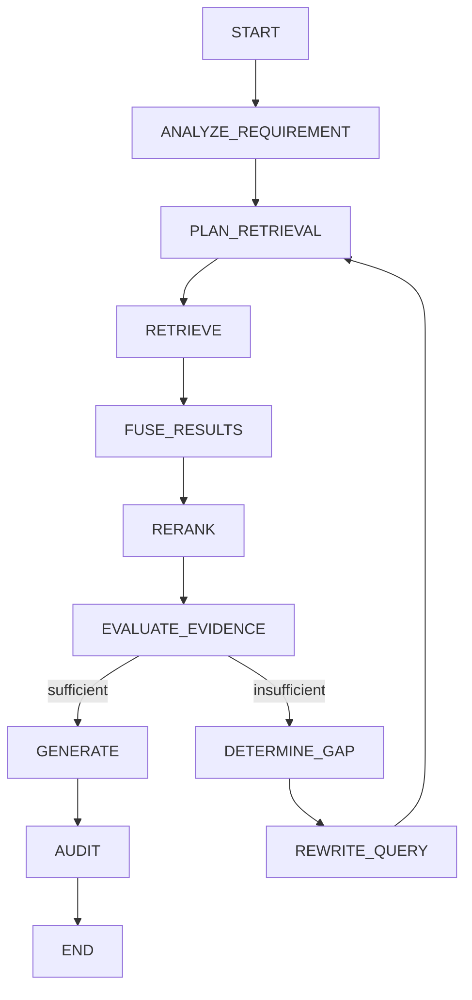

# Retrieval & Evidence Evaluation

This module is responsible for turning a compliance requirement into **evidence** — not just a list of semantically similar chunks. Standard RAG retrieval optimizes for relevance; compliance retrieval has to additionally answer *"is this actually proof, and is it trustworthy proof?"*

## Why generic RAG retrieval isn't enough here

A high vector similarity score does not mean a requirement is satisfied. Retrieval for compliance reporting needs to be evaluated across several independent dimensions:

class RetrievalEvaluation(BaseModel):
    relevance: float
    coverage: float
    authority: float
    completeness: float
    consistency: float
    confidence: float
    sufficient: bool
    missing_evidence: list[str]
    reason: str

| Dimension | Meaning |
|---|---|
| `relevance` | Does retrieved evidence relate to the question? |
| `coverage` | Does it cover the important aspects of the question? |
| `authority` | Is the evidence from an authoritative source/document? |
| `completeness` | Is enough evidence present to answer safely? |
| `consistency` | Do retrieved sources agree rather than conflict? |
| `confidence` | Overall confidence that evidence is sufficient |
| `sufficient` | Can generation proceed without another retrieval attempt? |
| `missing_evidence` | What information is still missing? |

### Relevance
Did we retrieve information related to the requirement at all?
`0.0 ─────────────── 1.0`

### Coverage
Did we retrieve *all* important aspects of the requirement — not just the parts that are easiest to match semantically?

**Example**

> Requirement: Access must be *restricted*, *reviewed*, *periodically recertified*, and *revoked on termination*.
>
> Retrieved: restricted ✅ · reviewed ✅ · recertified ❌ · termination ❌

Semantic similarity can be high here while coverage is still poor — the two signals are not interchangeable.

### Authority
Is the evidence coming from an appropriate source? For compliance reporting, *where* a fact comes from matters as much as what it says.

```
Regulation
    ↓
Official regulatory document
    ↓
Organisation policy
    ↓
Organisation procedure
    ↓
Audit evidence
    ↓
Generic website
```

### Completeness
Does the evidence actually answer the requirement, or only gesture at it?

**Example**

> Requirement: *Employees must complete security awareness training annually, and completion must be documented.*
>
> Evidence: *"Employees receive security training."*

Relevant — but incomplete. Frequency and documentation of completion are both unaddressed.

### Consistency
What happens when two sources disagree?

> Policy A: *Training annually.*
> Policy B: *Training every two years.*

This is **not** a low-confidence retrieval problem — it's a conflicting-evidence problem, and the system should surface the conflict rather than silently picking one source.

---

## Confidence scoring

Confidence must be **derived from measurable signals**, not generated arbitrarily by an LLM call. A bare `{"confidence": 0.91}` returned by a model is not trustworthy on its own — there's no way to audit how that number was produced.

```
retrieval signals
      │
      ├── vector score
      ├── reranker score
      ├── evidence coverage
      ├── source authority
      ├── evidence agreement
      ├── freshness
      └── evaluator assessment
               │
               ▼
       Confidence Calculator
               │
               ▼
          final confidence
```

Draft weighting (**not finalized** — see [Status](#status--roadmap)):

```python
confidence = (
    0.25 * relevance +
    0.25 * coverage +
    0.15 * authority +
    0.15 * completeness +
    0.10 * consistency +
    0.10 * reranker_score
)
```

These weights should not be hardcoded permanently. The signals and a deterministic evaluation framework come first; weights get tuned against real evaluation data afterward.

---

## Evidence states

Rather than a single float, retrieval outcomes are classified into explicit states:

| State | Meaning |
|---|---|
| `SUFFICIENT` | Evidence fully satisfies the requirement |
| `PARTIAL` | Evidence addresses part of the requirement, but not all of it |
| `INSUFFICIENT` | Evidence retrieved is unrelated or too weak to support the requirement |
| `CONFLICTING` | Multiple sources disagree on the same requirement |
| `NO_EVIDENCE` | Nothing meaningful was retrieved |

**Examples**

```
SUFFICIENT
  Requirement: Annual security awareness training.
  Evidence: "Annual Security Awareness Training is provided to all staff."

PARTIAL
  Requirement: Annual security training with completion tracking.
  Evidence: "Security awareness training is provided annually."
  → frequency known, completion tracking unknown

INSUFFICIENT
  Requirement: Access must be reviewed quarterly.
  Evidence: "Access is restricted to authorized employees."
  → addresses restriction, not review cadence

CONFLICTING
  Policy A: Access reviewed quarterly.
  Policy B: Access reviewed annually.

NO_EVIDENCE
  Nothing meaningful retrieved.
```

These states are the primary signal surfaced in compliance reports — more actionable for an auditor or compliance officer than a raw confidence score alone.

---

## Data models

### `RetrievalResult` — "what did the search engine find?"

```python
class RetrievalResult(BaseModel):
    chunk_id: UUID
    document_id: UUID
    document_version_id: UUID
    chunk_index: int
    page_number: int | None
    document_title: str
    text: str
    score: float
    source: str
```

### `Evidence` — "what does the system believe this material proves?" *(planned)*

`Evidence` is kept distinct from `RetrievalResult` because the two answer different questions — one describes a search hit, the other describes a judgment about that hit.

```python
class Evidence(BaseModel):
    retrieval: RetrievalResult
    relevance: float
    supports: bool
    support_type: str
    rationale: str
```

Pipeline shape:

```
RetrievalResult
      ↓
Evidence Extraction
      ↓
Evidence Set
```

---

## Requirement-driven planning *(planned)*

For a multi-country, multi-framework compliance engine, the planner should reason over a structured requirement rather than a bare query string:

```python
ComplianceRequirement(
    framework="SOC2",
    control="CC6.1",
    jurisdiction="US",
    industry="SaaS",
    requirement="Logical access must be restricted...",
)
```

```
Requirement
     │
     ├── organisation evidence
     │
     ├── applicable regulation
     │
     ├── policy
     │
     ├── procedure
     │
     └── audit evidence
```

This gives the planner enough context to reason about *which sources* are appropriate to check for a given control, jurisdiction, and industry — rather than issuing one generic similarity search.

---

## Retrieval workflow



**Design note:** `EVALUATE_EVIDENCE` only produces an evaluation — it does not itself decide to rewrite the query. A separate decision function consumes that evaluation and determines the next action. Keeping evaluation and control-flow decisions separate keeps the graph easier to extend (e.g. adding new evidence states or retry strategies later without touching the evaluation node itself).

---

## Status & roadmap

| Component | Status |
|---|---|
| `RetrievalResult` | ✅ Implemented |
| Evaluation dimensions (relevance, coverage, authority, completeness, consistency) | 🔲 Planned |
| Confidence calculator + signal weighting | 🔲 Planned — weights are illustrative, not tuned |
| Evidence states (`SUFFICIENT` / `PARTIAL` / `INSUFFICIENT` / `CONFLICTING` / `NO_EVIDENCE`) | 🔲 Planned |
| `Evidence` model (separate from `RetrievalResult`) | 🔲 Planned |
| `ComplianceRequirement`-driven planning | 🔲 Planned |
| Full evaluate → gap → rewrite graph | 🔲 Planned — evolves current LangGraph retrieval flow |


## we eventually support:
- SOC 2
- ISO 27001
- GDPR
- HIPAA
- PCI DSS
- Indian regulations
- EU regulations
- US regulations
- industry-specific controls
- different organizations
- different document formats

## compliance engine may have multiple kinds of evidence:
 - Regulation
 - Government guidance
 - Industry framework
 - Organization policy
 - Internal procedure
 - Audit report
 - Certification
 - Contract
 - Technical documentation

## Evaluator Architecture (deterministic + semantic evaluation)

                        Retrieved Results
                           │
             ┌─────────────┴─────────────┐
             │                           │
        Deterministic                 LLM Judge
        Evaluation                    Evaluation
             │                          │
             ├─ relevance               ├─ semantic relevance
             ├─ coverage                ├─ evidence coverage
             ├─ authority               ├─ missing evidence
             ├─ completeness            ├─ contradictions
             └─ consistency             └─ semantic sufficiency
             │                           │
             └─────────────┬─────────────┘
                           │
                    Evaluation Fusion
                           │
                    Final Confidence
                           │
                     Policy Decision


## two-stage evaluation architecture:
### Stage 1 — deterministic gate
    Fast, cheap, explainable:
    - relevance
    - coverage
    - authority
    - applicability
    - completeness
    - consistency
    - confidence

### Stage 2 — semantic judge
    Only when necessary:
    - Does the retrieved evidence actually answer the question?
    - Is important evidence missing?
    - Are multiple chunks collectively sufficient?
    - Is there contradictory evidence?
    - What evidence is missing?                   

User / Organization
        │
        ▼
Compliance Question
        │
        ▼
Regulatory Scope
        │
        ├── Country
        ├── Industry
        ├── Framework
        ├── Regulation
        └── Organization
        │
        ▼
Planner
        │
        ▼
Retrieval
        │
        ├── Vector
        ├── Graph
        ├── Web
        └── Tools
        │
        ▼
Reranker
        │
        ▼
Evidence Evaluation
        │
        ├── sufficient
        │
        └── insufficient
        │
        ▼
Retry / Expand Retrieval
        │
        ▼
Evidence-grounded Generation
        │
        ▼
Compliance Finding
        │
        ▼
Audit / Report